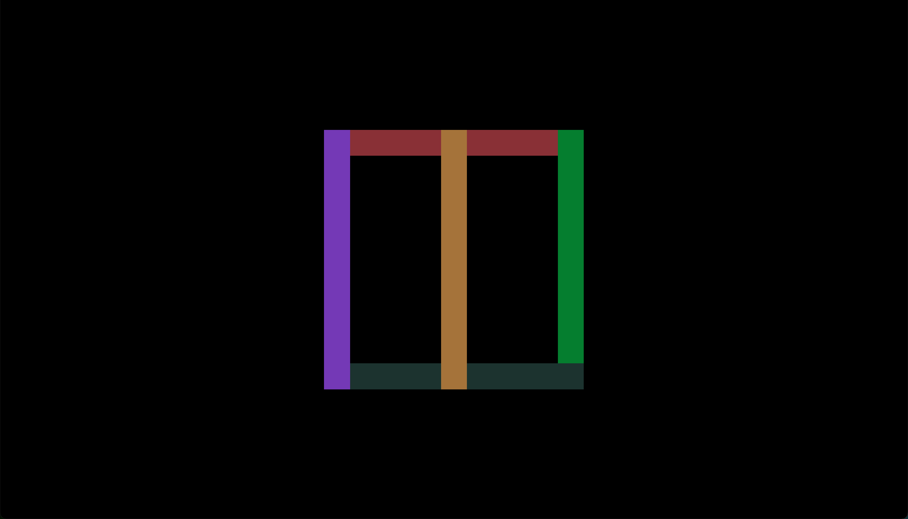
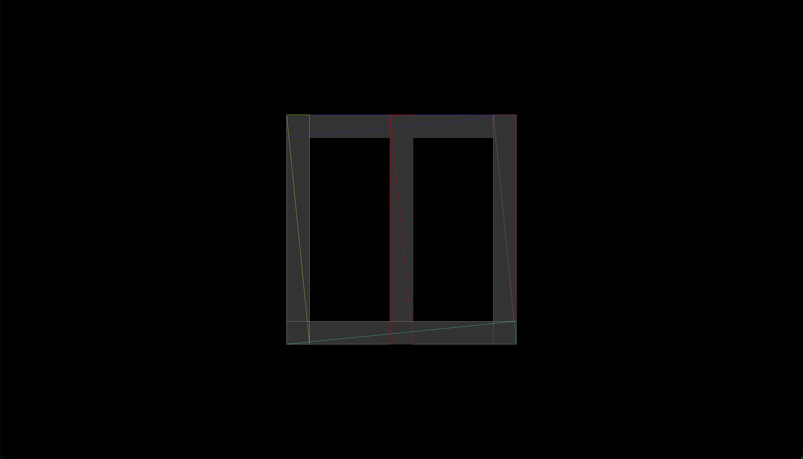

# 概述

该项目演示了如何使用 [@turf/union](https://www.npmjs.com/package/@turf/union) 来融合多个几何图形，并且使用 [earcut](https://www.npmjs.com/package/earcut) 和 [three.js](https://www.npmjs.com/package/three) 来绘制融合后的集合图形。

 

# 原始

下图是融合之前的状态，我准备将 5 个长方形融合为一个几何图形。

 

# 结果

下图是融合之后的状态，5 个长方形被融合成了一个几何图形，这个几何图形拥有 2 个孔洞，我使用线条来描绘出了它的三角剖分的结果。

 

# 运行

依次执行下述命令，来运行该项目：

1. `npm install`
2. `npm run start`

 

# 许可

本项目遵循 [MIT](https://github.com/jynxio/simplecode-turfunion/blob/main/license) 协议。

 
